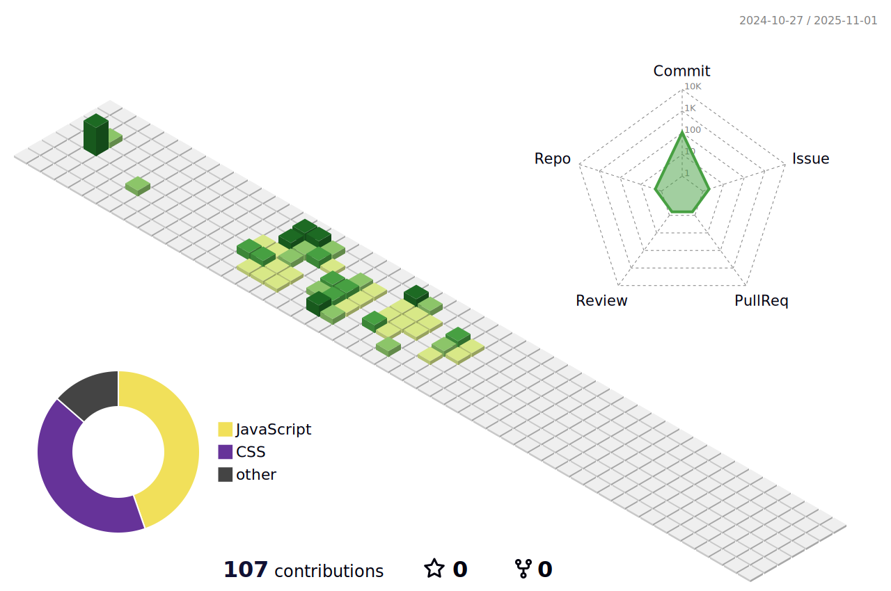

### 个人简介
- I am just a mediocre  web front-end developer! 
- 😄 &nbsp; [Here](https://blog.csdn.net/qq_41990338) is a place to write articles
---

 
### 技能简介
- 熟练掌握html5，css3，js，ts，熟悉响应式开发页面，100%还原设计稿；
- 熟练掌握vue2/3以及周边工具：vue-router、pinia、vant3/4以及element-plus进行web开发；
- 熟练使用前端工程化工具：webpack、vite 完成web 应用打包以及对应的前端性能优化；
- 熟悉并独立开发支付宝小程序、微信小程序、微信公众号h5，有发布上线项目经验；
- 熟悉npm部署私服流程，有从0搭建公司内部公用的项目组件库经验；
- 了解微信小程序服务商开发模式，接入过微信商家支付模式，了解threejs、gasp，有360看房、加载模型经验。

- 

  <code></code>
  <code></code>
  <code></code>
  <code></code>
  <code></code>
  <code></code>
  <code></code>

---

  

---
### 提交记录

